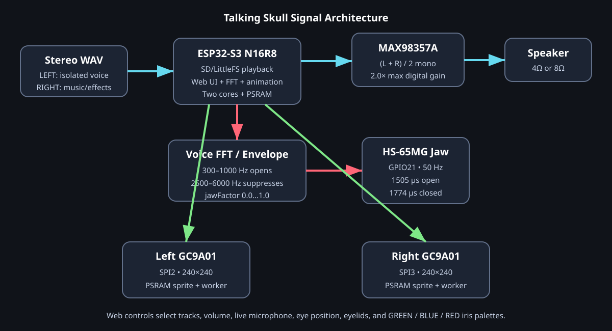
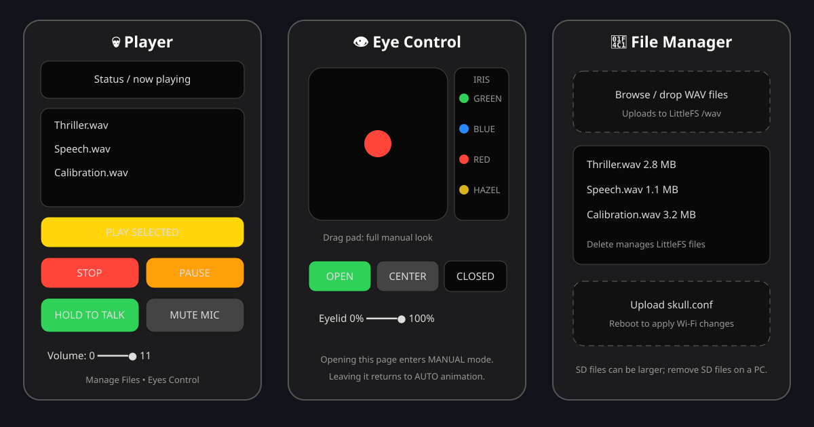
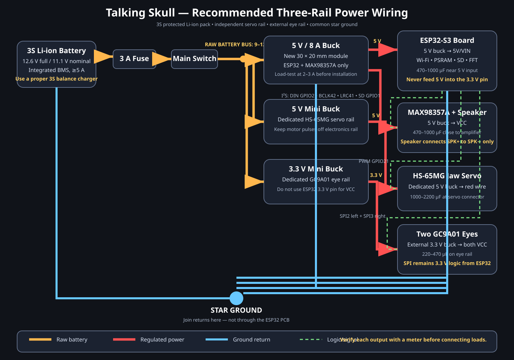
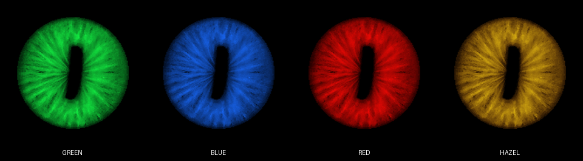
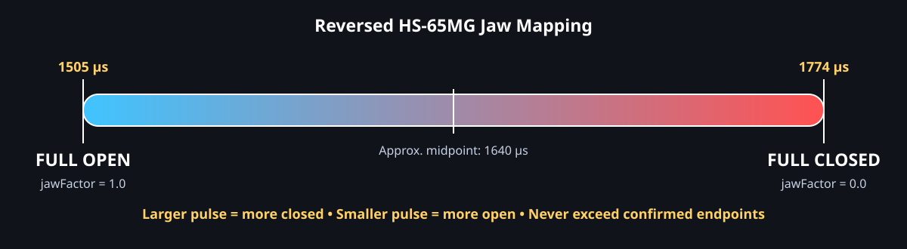

[README.md](https://github.com/user-attachments/files/32449042/README.md)
# ESP32-S3 Talking Skull with FFT Jaw and Animated Demon Eyes

A build and operating manual for a Wi-Fi-controlled Halloween talking skull using:

- an **ESP32-S3-WROOM-1-N16R8** board (16 MB flash, 8 MB PSRAM),
- an **HS-65MG** jaw servo,
- a **MAX98357A** I²S class-D amplifier,
- two **240×240 GC9A01** round displays on independent SPI buses,
- LittleFS and/or the board's microSD slot for PCM WAV files,
- browser playback, volume, live-microphone, file-management, and eye controls.

The current eye renderer uses a **184×184 fibrous demon iris** with a permanently black vertical pupil. The web interface can select **green, blue, red, or hazel** without storing separate images for each palette.



> [!WARNING]
> This project moves a real servo and can damage a jaw mechanism if its pulse limits are wrong. The `1505 µs` and `1774 µs` values in this repository were measured for one specific skull. Calibrate your own mechanism and never copy an endpoint blindly.

## Contents

1. [Features](#1-features)
2. [Bill of materials](#2-bill-of-materials)
3. [Power system](#3-power-system)
4. [Pin map](#4-pin-map)
5. [Software installation](#5-software-installation)
6. [Wi-Fi configuration](#6-wi-fi-configuration-skullconf)
7. [Preparing WAV files](#7-preparing-wav-files)
8. [Web interface manual](#8-web-interface-manual)
9. [Jaw setup and calibration](#9-jaw-setup-and-mechanical-calibration)
10. [Jaw-motion tuning](#10-jaw-motion-tuning)
11. [Eye customization](#11-eye-customization)
12. [Serial errors and warnings](#12-serial-errors-and-warnings)
13. [Troubleshooting](#13-troubleshooting)
14. [Safety checklist](#14-safety-and-reliability-checklist)
15. [Credits and licensing](#15-credits-and-licensing)

---

## 1. Features

### Audio and jaw

- Plays mono or stereo, 16-bit PCM WAV files from LittleFS or microSD.
- Supports sample rates from **8 kHz through 48 kHz**.
- Recommended stereo file layout:
  - **LEFT:** isolated vocals used by the jaw FFT.
  - **RIGHT:** music/effects.
- Speaker receives `(LEFT + RIGHT) / 2` as mono.
- Jaw analysis receives the unscaled left channel, so changing speaker volume does not change jaw motion.
- Vowel energy in approximately **300–1000 Hz** opens the jaw.
- Sibilant/consonant energy in approximately **2500–6000 Hz** suppresses opening.
- Full-range jaw movement with smoothing, deadband, rate limiting, and fail-closed behavior.
- Software volume boost up to `2.0×`, with saturating 16-bit output protection.

### Eyes

- Two GC9A01 displays on **separate SPI2 and SPI3 buses**.
- One PSRAM-backed 240×240 sprite and one persistent push worker per display.
- Independent autonomous saccades and micro-drift.
- Coordinated blinks and occasional expressive squints.
- Independent brightness flares.
- Green, blue, red, and predatory hazel iris palettes from one intensity texture.
- Independent compile-time 180° mounting correction for each display.
- Full-screen manual eye-center travel with smoothed browser commands.

### Web interface

- Track list and playback controls.
- Stop and pause/resume.
- Spinal Tap volume display from **0 to 11**.
- Hold-to-talk live microphone.
- WAV and `skull.conf` upload page.
- Manual eye-position, color, eyelid, open/close, and center controls.



---

## 2. Bill of materials

| Quantity | Item | Notes |
|---:|---|---|
| 1 | ESP32-S3-WROOM-1-N16R8 board | This pin map targets the OceanLabz/GOOUUU-style CAM board with onboard microSD. |
| 2 | GC9A01 1.28-inch 240×240 round SPI display | Seven-pin modules: GND, VCC, SCL, SDA, RES, DC, CS. |
| 1 | MAX98357A I²S mono amplifier | Operate from 5 V for maximum speaker output. Leave GAIN floating if grounding it introduces noise. |
| 1 | 4 Ω or 8 Ω speaker, approximately 3 W | Connect only between `SPK+` and `SPK−`; neither speaker terminal goes to ground. |
| 1 | Hitec HS-65MG servo | Operating range 4.8–6.0 V. This build uses a reversed mechanical installation. |
| 1 | microSD card | Optional but recommended for large WAV collections. |
| 1 | 5 V main buck converter | Size for at least 3 A continuous; the tested compact design discussed during development used a nominal 5 V/8 A module, derated below 5 A continuous. |
| 1 | 5 V servo buck converter | At least 2 A continuous; 3 A preferred. |
| 1 | 3.3 V eye regulator | 500–600 mA minimum; 1 A preferred. |
| 1 | Protected power source | A protected 3S Li-ion pack or a regulated 9–12 V supply is convenient for buck-only rails. |
| — | Bulk capacitors | See the power section. |
| — | Wire, fuse, switch, connectors | Use polarized/locking connectors for serviceable harnesses. |

### Recommended connector approach

The GC9A01 header is an unkeyed 1×7, 2.54 mm male header. A normal Dupont housing can be reversed. For a serviceable installation:

1. Correctly install and permanently retain a 1×7 female Dupont pigtail at the display.
2. Splice it to a keyed, latching 7-pin JST-SM inline pair.
3. Make only the keyed connector accessible during assembly.

For a direct professional replacement, desolder the display's bare header and install a 7-position Molex KK 254 friction-lock system.

---

## 3. Power system

Do **not** power the servo or both display backlights through the ESP32 board.



### Recommended rails

| Rail | Loads | Conservative capacity |
|---|---|---:|
| 5 V main | ESP32 `5V/VIN`, MAX98357A | 3 A minimum |
| 5 V servo | HS-65MG red power lead | 2 A minimum; 3 A preferred |
| 3.3 V eyes | Both GC9A01 `VCC` pins | 0.5 A minimum; 1 A preferred |

All grounds must join at a common **star ground**. The servo's high-current return should not travel through the ESP32 PCB or the amplifier ground wiring.

### Approximate worst-case current

| Load | Conservative maximum |
|---|---:|
| HS-65MG stalled | 1.0–1.2 A |
| MAX98357A at high output into 4 Ω | 0.7–0.8 A |
| ESP32-S3, Wi-Fi, PSRAM and board overhead | 0.4–0.5 A |
| SD activity | 0.15–0.20 A |
| Two GC9A01 modules | approximately 0.10–0.15 A |
| **Combined 5 V-equivalent peak** | approximately **2.5–3 A** |

### Local bulk capacitance

| Location | Recommended starting value |
|---|---:|
| Servo connector | 1000–2200 µF low-ESR + 0.1 µF |
| MAX98357A | 470–1000 µF + 10 µF + 0.1 µF |
| ESP32 5 V input | 470–1000 µF |
| External 3.3 V eye rail | 220–470 µF + local 10 µF/0.1 µF per eye |

Load-test inexpensive buck modules before installation. A label such as “3 A” often means peak current, not safe continuous current in a closed skull.

---

## 4. Pin map

### Jaw servo

| Signal | ESP32 pin |
|---|---:|
| HS-65MG PWM | GPIO21 |
| Servo power | Dedicated regulated 5 V rail |
| Servo ground | Star ground |

Typical servo colors are red for power, brown/black for ground, and orange/white/yellow for PWM. Verify your servo.

### MAX98357A

| MAX98357A | ESP32 |
|---|---:|
| `SD_MODE` / enable | GPIO1 |
| `DIN` | GPIO2 |
| `BCLK` | GPIO42 |
| `LRC` / `WS` | GPIO41 |
| `VCC` | Main 5 V rail |
| `GND` | Star ground |

Leave the amplifier GAIN pin floating unless you have a specific, tested reason to change analog gain. This build obtains extra level digitally and avoids the noise encountered with high analog gain.

### Left GC9A01 — SPI2

| Display pin | ESP32 pin |
|---|---:|
| `SCL` / clock | GPIO15 |
| `SDA` / MOSI | GPIO16 |
| `DC` | GPIO17 |
| `CS` | GPIO18 |
| `RES` / reset | GPIO8 |
| `VCC` | External regulated 3.3 V |
| `GND` | Star ground |

### Right GC9A01 — SPI3

| Display pin | ESP32 pin |
|---|---:|
| `SCL` / clock | GPIO10 |
| `SDA` / MOSI | GPIO11 |
| `DC` | GPIO12 |
| `CS` | GPIO13 |
| `RES` / reset | GPIO14 |
| `VCC` | External regulated 3.3 V |
| `GND` | Star ground |

### Onboard microSD

The board's microSD slot is fixed in 1-bit SD_MMC mode:

| SD_MMC signal | GPIO |
|---|---:|
| CMD | 38 |
| CLK | 39 |
| D0 | 40 |

### Reserved pins

- GPIO35, GPIO36, GPIO37: octal PSRAM; never use.
- GPIO19, GPIO20: native USB.
- GPIO48: onboard WS2812.
- GPIO0, GPIO3, GPIO45, GPIO46: boot/strapping pins; avoid where possible.

---

## 5. Software installation

### Requirements

- Visual Studio Code with PlatformIO, or PlatformIO Core.
- USB cable capable of data transfer.
- Git access for pinned PlatformIO dependencies.

The project intentionally uses **LovyanGFX**, not TFT_eSPI. LovyanGFX supports the two independent SPI hosts and current dual-worker architecture cleanly.

### Project layout

```text
TalkingSkull/
├── platformio.ini
├── boards/
│   └── partitions/
│       └── partitions_16MB_10MB_FS.csv
├── src/
│   ├── main.cpp
│   ├── GC9A01_Eyes.h
│   ├── I2SWavPlayer.cpp
│   ├── WiFiSkullController.cpp
│   ├── ...
│   └── uncanny/
│       ├── DemonEye184.h
│       ├── README.md
│       └── LICENSE-ESP32LCDRound240x240Eyes.txt
└── data/                         # optional initial LittleFS image
```

The partition CSV creates two 3 MB application slots and approximately 9.9 MB of LittleFS.

### Build and upload

```bash
pio run -e wroom-n16r8-wav-both
pio run -e wroom-n16r8-wav-both -t upload
pio device monitor -b 115200
```

For a brand-new or unformatted LittleFS partition, create a `data/` directory and upload an initial filesystem once:

```bash
pio run -e wroom-n16r8-wav-both -t uploadfs
```

> [!CAUTION]
> `uploadfs` replaces the LittleFS image. Do not run it later without backing up uploaded WAVs and `skull.conf`.

### Successful build reference

The MIT-licensed, quiet release was clean-built with:

```text
Flash: 1,317,471 / 3,145,728 bytes (41.9%)
Static RAM: 61,356 / 327,680 bytes (18.7%)
```

PlatformIO may display the base board description as an N8/no-PSRAM DevKit. The explicit project overrides configure 16 MB flash and OPI PSRAM. If hardware capacity must be verified, temporarily inspect `ESP.getFlashChipSize()` and `ESP.getPsramSize()` in a development build; routine capacity printing is removed from the production release.

---

## 6. Wi-Fi configuration (`skull.conf`)

Configuration is loaded from `/skull.conf`, preferring the SD card when available and otherwise using LittleFS. Lines beginning with `#` are comments.

### Station-mode example

```ini
# Join an existing 2.4 GHz network
wifi_mode=sta
sta_ssid=YOUR_2G_WIFI_NAME
sta_password=YOUR_WIFI_PASSWORD
sta_ip=dhcp
sta_gateway=192.168.1.1
sta_subnet=255.255.255.0

# Used if station connection fails and the skull falls back to AP mode
ap_ssid=TalkingSkull
ap_password=change-me-now
ap_ip=192.168.4.1
ap_gateway=192.168.4.1
ap_subnet=255.255.255.0

# Internal firmware scale is 0..30; 30 appears as 11 in the web UI
volume=30
```

### Access-point example

```ini
wifi_mode=ap
ap_ssid=TalkingSkull
ap_password=change-me-now
ap_ip=192.168.4.1
ap_gateway=192.168.4.1
ap_subnet=255.255.255.0
volume=25
```

An AP password should contain at least eight characters. After editing or uploading `skull.conf`, reboot the skull.

### Finding the web page

- In station mode, try `http://talkingskull.local`.
- Otherwise check the DHCP lease table in your router, or use the configured AP IP after fallback.
- In AP mode, connect to the configured skull SSID and browse to its configured AP IP.

---

## 7. Preparing WAV files

### Required format

```text
Container: RIFF/WAVE
Encoding:  signed 16-bit PCM
Channels:  mono or stereo
Rate:      8–48 kHz
```

Recommended music files are stereo:

```text
LEFT  = isolated voice for FFT jaw analysis
RIGHT = music/effects
```

The speaker output is the mono average of both channels. Do not put the vocal only on the right channel; the jaw would not see it.

### FFmpeg example: combine vocal and music stems

```bash
ffmpeg -y \
  -i vocals.wav \
  -i music.wav \
  -filter_complex "[0:a]aformat=channel_layouts=mono[v];[1:a]aformat=channel_layouts=mono[m];[v][m]join=inputs=2:channel_layout=stereo[a]" \
  -map "[a]" \
  -ar 44100 \
  -c:a pcm_s16le \
  TalkingSkull.wav
```

For smaller calibration or speech files, 16 kHz stereo PCM greatly reduces size:

```bash
ffmpeg -y -i input.wav -ar 16000 -ac 2 -c:a pcm_s16le output_16k.wav
```

### Storage rules

- Web uploads go to LittleFS `/wav`.
- The web uploader rejects files larger than 8 MiB.
- Larger files should be copied to the SD card on a computer.
- SD WAVs may be placed in `/` or `/wav`.
- The player streams SD files and files larger than its 3 MB preload threshold.
- The web delete button removes LittleFS files; remove SD files using a computer.

---

## 8. Web interface manual

### Player page — `/`

#### File list

Displays WAV files found in LittleFS and on SD. Select a file, then press **PLAY SELECTED**.

#### STOP

Stops playback immediately, closes the mouth using the configured slew, and detaches the jaw servo after settling.

#### PAUSE / RESUME

Pause closes and detaches the mouth. Resume reattaches the servo closed and restarts audio/jaw processing.

#### HOLD TO TALK

While held, the browser microphone is sent as 16 kHz mono PCM over WebSocket port 81. Release to stop.

Browser microphone APIs normally require HTTPS or localhost. A plain local-network HTTP page may require an explicit browser exception. Use live microphone only on a trusted local network.

#### MUTE MIC

Mutes only the live browser microphone stream. It does not mute WAV playback.

#### Volume 0–11

The display is a *This Is Spinal Tap* reference. Internally it maps to the unchanged 0–30 firmware scale:

| Web | Internal |
|---:|---:|
| 0 | 0 |
| 1 | 3 |
| 2 | 5 |
| 3 | 8 |
| 4 | 11 |
| 5 | 14 |
| 6 | 16 |
| 7 | 19 |
| 8 | 22 |
| 9 | 25 |
| 10 | 27 |
| 11 | 30 |

At internal volume 30 the digital PCM factor is 2.0×. Samples that exceed signed 16-bit range are saturated safely. If distortion is audible, lower the volume.

### File manager — `/upload`

- Browse or drag-and-drop WAV files into LittleFS.
- View LittleFS and SD capacity.
- Delete LittleFS WAVs.
- Upload `skull.conf` to SD and/or LittleFS.
- Stop playback before uploading.

### Eye control — `/eyes`

Opening this page enters manual mode. Leaving it returns to autonomous animation.

#### Touch pad

Moves both visible iris centers manually. The control uses one-pixel coordinates and coalesces browser requests to avoid stale-position jitter. At extremes, the iris is intentionally clipped by the display edge and the newly exposed area is black.

#### Iris color

Four radio buttons select:

- **GREEN** — emerald.
- **BLUE** — electric blue.
- **RED** — saturated red.
- **HAZEL** — deep olive-brown fibers with unsettling gold/green highlights.

The selection changes the hue but preserves the same fiber intensity map. The vertical pupil always remains black. Autonomous brightness flares continue in the selected color.



#### OPEN / CLOSED

Immediately set the manual eyelid control to fully open or fully closed.

#### CENTER

Returns the eye position to the center without changing color or eyelid setting.

#### Eyelid slider

- `0%` = closed.
- `100%` = open.

When the page closes, autonomous blink and squint behavior resumes.

### Browser caching

The UI is compiled into firmware. After flashing a version that changes HTML or JavaScript, force-refresh the page, use a private window, or add a cache-busting query:

```text
http://talkingskull.local/eyes?v=10
```

---

## 9. Jaw setup and mechanical calibration



### Current reversed mapping

```cpp
JAW_OPEN_US   = 1505;  // smaller pulse: more open
JAW_CLOSED_US = 1774;  // larger pulse: more closed
```

The current active range is:

```text
1774 − 1505 = 269 µs
```

The approximate command is:

```text
target pulse = JAW_CLOSED_US − jawFactor × active range
```

Therefore:

| `jawFactor` | Approximate result |
|---:|---|
| 0.0 | 1774 µs, fully closed |
| 0.5 | approximately 1640 µs, mid travel |
| 1.0 | 1505 µs, fully open |

### Calibrate safely

1. Disconnect the jaw linkage or remove servo load when finding an initial neutral position.
2. Begin from a known conservative pulse.
3. Move in approximately **5 µs increments**.
4. Stop if the servo buzzes, heats, flexes the linkage, draws excessive current, or presses against a hard stop.
5. Confirm both endpoints mechanically before entering them in firmware.
6. Once confirmed, keep every write clamped between them.

For the HS-65MG, approximately 9–10 µs corresponds to one degree of servo-shaft rotation. Jaw angle differs because linkage geometry introduces a ratio and may be nonlinear.

### Never “fix” closure by blindly increasing the pulse

If the jaw relaxes open only after playback, it may be drifting because the firmware intentionally detaches the servo after settling. That is a hold-strategy or linkage issue, not automatically a reason to exceed the closed endpoint.

---

## 10. Jaw-motion tuning

There are two tuning layers:

1. **Audio analysis** decides `jawFactor` from 0.0 to 1.0.
2. **Servo mapping** smooths, limits, and converts that factor into pulse width.

Change one item at a time and keep a copy of known-good values.

### Mechanical travel controls — `main.cpp`

```cpp
static constexpr uint16_t JAW_OPEN_US = 1505;
static constexpr uint16_t JAW_CLOSED_US = 1774;
static constexpr float JAW_OPEN_LIMIT_FRACTION = 1.00f;
```

To reduce maximum opening without changing safe endpoints, lower `JAW_OPEN_LIMIT_FRACTION`:

| Fraction | Active open pulse with current endpoints | Effect |
|---:|---:|---|
| 1.00 | 1505 µs | Full confirmed travel |
| 0.95 | approximately 1518 µs | 5% less opening |
| 0.90 | approximately 1532 µs | 10% less opening |
| 0.85 | approximately 1545 µs | 15% less opening |

### Servo response controls — `main.cpp`

```cpp
JAW_TARGET_DEADBAND_US = 5;
JAW_ATTACK_ALPHA       = 0.45;
JAW_RELEASE_ALPHA      = 0.22;
JAW_ENVELOPE_THRESHOLD = 15.0;
```

| Setting | Increase it to… | Decrease it to… |
|---|---|---|
| Attack alpha | Open toward new vowel targets faster | Soften opening |
| Release alpha | Close toward gaps/consonants faster | Hold openings longer |
| Deadband | Ignore more tiny changes and reduce chatter | Follow finer movement |
| Envelope threshold | Reject more low-level leakage/noise | Respond to quieter vocals |

The two slew constants limit pulse change per 20 ms update. Because this servo is mechanically reversed and the historical constant names predate that installation, verify physical direction on the mechanism before changing either slew value.

### FFT/envelope controls — `main.cpp`

Current setup:

```cpp
audioFFT.setConfig(
    EnvelopeConfigFast(
        0.70f,  // attack
        0.20f,  // release
        3.5f,   // analysis gain
        20.0f,  // noise floor
        50,     // hold ms
        0.65f,  // sibilant suppression
        1.25f,  // peak headroom
        1.70f   // jaw curve exponent
    )
);
```

| Symptom | First adjustment |
|---|---|
| Mouth stays too open overall | Raise `peakHeadroom`, e.g. 1.25 → 1.40 or 1.50 |
| Emphasized vowels no longer reach full open | Lower `peakHeadroom`, e.g. 1.25 → 1.15 |
| Word-to-word contrast is weak | Raise `jawCurveExp`, e.g. 1.70 → 2.0 or 2.2 |
| Mouth will not close between words | Raise release, e.g. 0.20 → 0.28, and/or lower hold 50 → 30 ms |
| Motion is fluttery inside a word | Lower release toward 0.15 and reduce curve slightly |
| Quiet vocal track barely moves | Raise analysis gain from 3.5 toward 5.0 |
| Consonants need stronger closure | Raise sibilant suppression from 0.65 toward 0.8 |

Do not use speaker volume to tune the jaw. FFT receives an unscaled analysis channel.

### Release logging policy

The release build intentionally omits continuous jaw, FFT, memory, playback, and calibration logging. This avoids serial overhead and keeps normal operation quiet. Critical errors and warnings remain enabled.

When developing a new jaw profile, add temporary instrumentation around `handleJawTick()` or use the historical examples in [`CALIBRATION.md`](CALIBRATION.md). A healthy phrase should still conceptually produce low jaw factors in gaps, medium factors on ordinary words, and occasional full-scale emphasized vowels. Remove temporary logging again before deployment.

---

## 11. Eye customization

### Current asset

```text
src/uncanny/DemonEye184.h
```

It contains:

- one 184×184 palette-neutral intensity texture,
- one 128×128 upper eyelid threshold map,
- one 128×128 lower eyelid threshold map.

At neutral position it leaves a 28-pixel black rim around the iris. During manual full travel, the iris center can reach each display edge and the image is clipped appropriately.

### Palette definitions

Edit `demonTextureColor()` in `GC9A01_Eyes.h`:

```text
GREEN: 8% red, 100% green, 28% blue
BLUE:  10% red, 42% green, 100% blue
RED:   100% red, 4% green, 2% blue
HAZEL: 90% red, intensity-dependent 45–76% green, 7% blue
```

All palettes use the same source intensity, so fiber detail remains identical.

### Display mounting orientation

Each display can be rotated 180° independently in `GC9A01_Eyes.h`:

```cpp
#define LEFT_GC9A01_INVERTED  1
#define RIGHT_GC9A01_INVERTED 1
```

Use `0` for the original right-side-up installation and `1` when that physical
GC9A01 is installed upside down. The current skull requires `1` for both eyes.

### Autonomous timing

The eye class contains separate timing controls for:

- per-eye saccades,
- micro-drift,
- per-eye brightness flares,
- full blinks,
- synchronized squints.

Change timing ranges conservatively. Rendering and SPI transfer workers run below the audio task priority so eye animation should never be allowed to starve audio.

### Why LovyanGFX remains

The original eye references used TFT_eSPI, but this skull already has:

- two independent SPI hosts,
- separate GC9A01 panel objects,
- PSRAM sprites,
- parallel workers,
- tested coexistence with audio and Wi-Fi.

The eye texture and animation are library-independent. Replacing LovyanGFX would add risk without improving image quality.

---

## 12. Serial errors and warnings

Serial remains initialized at **115200 baud**, but normal informational and calibration messages are disabled in the release build. A healthy boot can therefore be almost silent after the startup test tone.

Messages that remain include critical conditions such as:

```text
[SETUP] FATAL: ...
[I2S] ERROR: ...
[Eyes] ERROR: ...
[Eyes] WARNING: frame push still active ...
[JAW] ERROR: ...
[FFT] WARNING: invalid spectrum rejected; jaw forced closed
[WiFi] WARNING: STA failed after 8s; starting AP fallback
```

Treat repeated warnings as faults even if the skull appears to continue operating. Temporary verbose diagnostics can be added during development, but should be removed or disabled again before the production build.

---

## 13. Troubleshooting

### No audio

- Confirm MAX98357A `SD_MODE` is on GPIO1 and goes high.
- Confirm DIN/BCLK/LRC are GPIO2/42/41.
- Confirm the amplifier receives a strong 5 V rail.
- Connect the speaker only across `SPK+` and `SPK−`.
- Check the startup 440 Hz test tone.

### Audio is clean but too quiet

- Set the web volume to 11.
- Confirm `skull.conf` uses internal volume 30 if the web control does not reach the expected maximum.
- Leave GAIN floating if grounding it creates noise.
- If volume 11 is clean but remains quiet, investigate speaker sensitivity, enclosure, amplifier supply, and impedance rather than adding unlimited software gain.

### Audio is distorted

Lower volume one or two positions and listen again. Also inspect the 5 V rail under loud bass content and confirm the speaker impedance is appropriate.

### Jaw does not move

- Confirm `ENABLE_JAW_MOTION=true`.
- Confirm servo signal is GPIO21 and servo ground is common.
- Confirm the servo has its own 5 V supply.
- For stereo files, confirm vocals are on the left channel.
- If visual inspection is insufficient, temporarily instrument `handleJawTick()` to inspect `jawFactor`, envelope, target, and validity.

### Jaw is almost always open

Raise `peakHeadroom` or `jawCurveExp`; do not first reduce the safe mechanical closed endpoint.

### Jaw chatters

Increase deadband modestly, inspect power integrity, and avoid turning small FFT variations into servo commands. Macro word motion is more convincing than one-degree chatter.

### Eyes do not initialize

- Confirm external eye VCC and common ground.
- Confirm the two separate pin maps exactly.
- Verify both displays are GC9A01, 240×240.
- Check Serial for retained eye allocation, worker-creation, PSRAM, or frame-push errors.

### Manual eye movement jumps or recenters

The page queues only one request and coalesces to the newest position. Automatic position updates are suppressed while the page is in manual mode. Force-refresh after firmware updates so old JavaScript is not cached. For difficult timing faults, temporarily add mode-transition logging around the manual-state change.

### Left and right manual movement are reversed

This installation already applies `xInvert=1` in firmware. If your physical display mounting differs, edit the manual X mapping in `GC9A01_Eyes.h`.

### Web UI still shows an old control

Use a private browser window or a cache-busting URL. Confirm that the updated `WiFiSkullController.cpp` was copied before rebuilding.

### Upload fails above 8 MiB

The browser uploader intentionally limits LittleFS uploads. Copy large WAVs to the SD card, or reduce sample rate/channel count where appropriate.

### Linker reports many “multiple definition” errors

A `.cpp` file probably contains a pasted copy of another implementation. In particular, if symbols from `WiFiSkullController` appear as being defined by `I2SWavPlayer.cpp.o`, replace both source files with clean copies and run PlatformIO Clean.

### ESP32 resets when jaw moves or audio gets loud

- Separate servo and electronics converters.
- Add the recommended bulk capacitors.
- Use star grounding and heavier power wires.
- Measure rail voltage with an oscilloscope if possible; a multimeter may miss short dips.

---

## 14. Safety and reliability checklist

Before unattended operation:

- [ ] Servo endpoints were measured on this exact mechanism.
- [ ] No servo buzzing or binding at open/closed limits.
- [ ] Servo uses a dedicated regulator and local bulk capacitor.
- [ ] Both eyes use an external regulated supply, not the ESP32 3.3 V pin.
- [ ] All grounds meet at a star point.
- [ ] Battery pack has a BMS, fuse, and correct charger.
- [ ] Buck modules were load-tested in their installed thermal environment.
- [ ] Display connectors cannot be reversed by an operator.
- [ ] Speaker is connected BTL, not to ground.
- [ ] WAV playback was tested at maximum intended volume.
- [ ] Audio is clean, memory remains stable, and no repeated eye-worker or I²S errors appear.
- [ ] Wires are strain-relieved and cannot enter moving jaw parts.

---

## 15. Credits and licensing

The Talking Skull firmware is released under the MIT License. Every `.cpp` and `.h` file includes its purpose and the complete license notice; the project-level copy is [`LICENSE`](LICENSE).

The demon-eye texture and eyelid maps are derived from the MIT-licensed Goat/Krampus assets in:

- [thelastoutpostworkshop/ESP32LCDRound240x240Eyes](https://github.com/thelastoutpostworkshop/ESP32LCDRound240x240Eyes)
- Reviewed source commit: `0d987ac201cca626899565d2369dba2ce5fee24d`

The retained license is in:

```text
src/uncanny/LICENSE-ESP32LCDRound240x240Eyes.txt
```

The original eye project used TFT_eSPI. This integration ports the visual data and animation concepts to the skull's existing LovyanGFX dual-SPI architecture.

---

## Quick-start checklist

1. Assemble the three power rails and verify voltages without loads.
2. Wire the ESP32, amplifier, servo, and both displays according to the pin tables.
3. Insert a microSD card if used.
4. Place project files in the PlatformIO layout.
5. Set conservative, mechanically tested jaw endpoints.
6. Create and install `skull.conf`.
7. Build, upload, and monitor Serial at 115200 baud for retained errors or warnings.
8. Confirm the 440 Hz startup tone.
9. Confirm both eyes initialize and animate.
10. Open the web page and upload/select a correctly prepared WAV.
11. Tune jaw analysis one parameter at a time, adding temporary calibration instrumentation only when needed.
12. Complete the safety checklist before installation in the prop.
